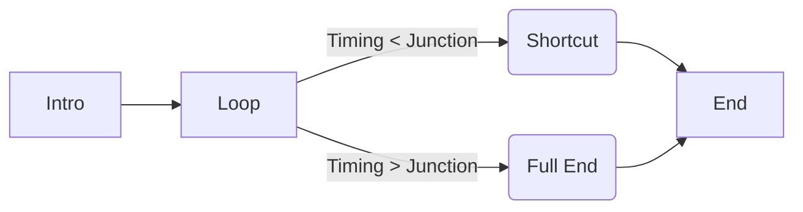

# TG SENIOR SEND-OFF 2026  
## AUDIO PLAYBACK SYSTEM

  
  


---

## Overview

**東北学院高等学校 2026年度 予餞会（TG SENIOR SEND-OFF 2026）** における、  
入退場曲のリアルタイム制御システム。

生徒の歩行速度やハプニングによる時間変動に柔軟に対応しつつ、  
**「音楽的な破綻（不自然なフェードアウトやカット）」を完全に排除する**  
ことを目的として設計された、**Web Audio API ベースのシーケンサー**です。

Chromebook 等の低スペック端末でも、**ミリ秒単位の精度**で安定動作するよう最適化されています。

---

## Architecture & Philosophy

従来の「ループ再生してフェードアウト」という手法は、  
感動的なシーンにおいて音楽のダイナミクスを殺してしまいます。

本システムでは、DAW（Logic Pro）で事前に計算・編集された  
**「分岐トラック（Bridge）」**を使用することで、

> **どのタイミングで終わっても、  
> まるで最初からそう作曲されていたかのようなエンディング**

を実現します。

---

## Logic Flow

楽曲は以下の **4 パーツ** に分割して管理されます。

1. **Intro**  
   冒頭部分。再生後、自動的に Loop へ移行。

2. **Loop**  
   周回再生されるメイン部分。

3. **Bridge（The Shortcut）**  
   Loop の特定の小節（Junction Point）から派生する「近道」トラック。

4. **Outro**  
   完全な終止を持つエンディング部分。

---

## The “Junction” Mechanism

オペレーター（江場）が **`TRIGGER FINALE`** ボタンを押したタイミングによって、  
システムは自動的に最適なルートを選択します。

### Pattern A: SHORTCUT MODE

- Junction Point（分岐点）より **前** にボタンを押下  
- システムは分岐点まで待機し、Loop から Bridge へ **シームレスに遷移**
- Bridge 自体が終止形を含むため、**最短ルートで美しく終了**

### Pattern B: FULL LOOP MODE

- Junction Point を **過ぎてから** ボタンを押下  
  （または Decision Window 通過後）
- 現在の Loop を最後まで再生し、その後 Outro へ接続


## Features

### Zero Latency Audio Switching

- `<audio>` タグではなく **AudioContext** を使用  
- メインスレッド負荷に依存しない、正確なスケジューリングを実現
- Chromebook 環境でも **グリッチ（音飛び）なし**

---

### Dual Scene Support

- **ENTRANCE（入場）** / **EXIT（退場）** をタブで切り替え可能
- 誤操作防止のため、**再生中はシーン切り替えをロック**

---

### Real-time Dashboard

- **Total Time / Loop Count**  
  再生状況の基本情報をリアルタイム表示
- **Decision Window**  
  「この周回でショートカット可能な残り時間」をカウントダウン表示  
  - 残り **10 秒** で赤く点滅  
  - 判断リミットを視覚的に明確化

---

### Robust Preloading

- **INITIALIZE SYSTEM** 実行時に、全音源アセットをデコードしてメモリに展開
- 本番中に **Wi-Fi が切断されても再生は継続**

---

## File Structure & Assets

Chrome での完全な **ギャップレス再生** を実現するため、  
音声ファイルは **AAC（`.m4a`）形式**を使用してください。

```
/
├── index.html        # Main Application (Vanilla JS + Tailwind via CDN)
└── audio/
    ├── intro.m4a          # 入場: イントロ
    ├── loop.m4a           # 入場: ループ
    ├── bridge.m4a         # 入場: 近道用トラック（冒頭波形は Junction と一致）
    ├── outro.m4a          # 入場: 完走用アウトロ
    ├── exit_intro.m4a
    ├── exit_loop.m4a
    ├── exit_bridge.m4a
    └── exit_outro.m4a
```

---

## Configuration

設定はすべて `index.html` 内の **`SCENE_CONFIG` オブジェクト**に集約されています。

```javascript
const SCENE_CONFIG = {
    ENTRANCE: {
        junctionPoint: 64.8, // ★重要: Loop 開始から何秒地点で Bridge に接続するか
        musicTitle: "UE WO MUITE ARUKOU (Piano & Brass Qt. Mix)",
        // ...
    },
    EXIT: {
        junctionPoint: 30.0,
        // ...
    }
};
```

### junctionPoint

- `loop.m4a` の **開始から数えた秒数（小数指定可）**
- Logic Pro 等の DAW 上で **必ず実測値を使用**してください

---

## Usage

### Deploy

- GitHub にプッシュ
- **Vercel** にデプロイ  
  ※ Google Drive / GAS は遅延リスクがあるため **使用禁止**

---

### Initialize

- Chromebook でシステムにアクセス
- **INITIALIZE SYSTEM** をクリック
- ステータスが **`SYSTEM READY`** になることを確認

---

### Operation

1. Scene を選択（**ENTRANCE** / **EXIT**）
2. **COMMENCE PLAYBACK** で再生開始
3. **Decision Window** のカウントダウンを監視
4. 対象者がステージに近づいたら **TRIGGER FINALE** を押下  
   → 以降の着地処理はシステムが自動制御

---

## Credits

- **System Development**: Keita Eba（Student Council President）
- **Music Production**: Keita Eba（Mix / Edit）
- **Original Composition (Inspiration)**:  
  Hachidai Nakamura / Susumu Hirasawa

Built for **Tohoku Gakuin Senior High School**, 2026.
